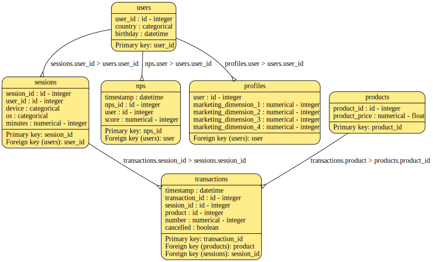

# SampQLe

A synthetic multi-table SQL sample. SDV - [Synthetic Data Vaut](https://sdv.dev) - modelss , a set of basic example values and relationships is expanded to a less trivial size. 

The default data look like this:

## License

[MIT](https://choosealicense.com/licenses/mit/)

## Features

CLI for running example scripts. Notebooks for annotated exploration.

## Synthesize a Database

1. If desired, customize data, tables, and relationships by adapting the prototypes and metadata in the data directory

2. If tables or relationships have changed, it may be necessary to adapt the `get_expanded_data` function in the synthesize module

3. Install the package locally with `poetry install`

4. Ensure you've supplied credentials pointing to a running database instance (see sample_credentials.json)

5. run `poetry run make-data`

## Run a Sample Script

For example, with the standard synthesis samples and a local postgres db running properly, output should look something like this:

`psql -d sampqle -f scripts/02_case_view.sql`

`psql -d sampqle -f scripts/03_group.sql`

 | Month  | Promoters | Passives | Detractors |
 |--------|-----------|-----------|------------|
 |2021-10 |         0 |         0 |          4 |
 |2021-11 |         0 |         7 |        143 |
 |2021-12 |         2 |        38 |        497 |
 |2022-01 |        22 |       135 |        141 |
 |2022-02 |        19 |         3 |          3 |
 |2022-03 |         1 |         0 |          0 |

## Included Examples

+ 01_table_stats.sql - *Describe row counts for all tables.*

+ 02_case_view.sql - *Use of case statements in creation of a view.*

+ 03_group.sql - *Aggregates and groups a view.*

+ 04_with_CTE.sql - *Combines transaction and session data, then joins and aggregates a view to help identify poor performing products.*

+ 04_with_subquery - *A version of query 4 written with a subquery format.*

+ 04t_test_same.sh - *A one-liner to test that 04 queries are the same. Pass returns nothing.*