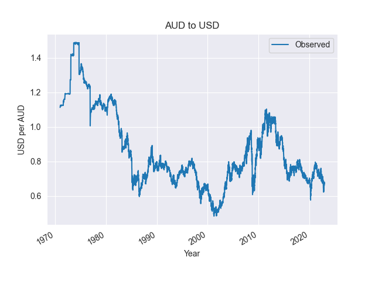

# SampQLe

A set of SQL samples arranging and querying databases of synthetic data. With SDV [Synthetic Data Vaut](https://sdv.dev) models, a set of basic example values and relationships is expanded to a less trivial size. A number of sample scripts are included to demonstrate queries with potential analytical value. Currently includes a multi-table database mimicking tables related to an ecommerce business and a timeseries example based on a frame of currency exchange rates.

The default schema of the ecommerce database looks like this:

A sample of aud_usd table data from timeseries:

## License

[MIT](https://choosealicense.com/licenses/mit/)

## Features

CLI with Click for running database synthesis.

## Synthesize a Database

1. If desired, customize data, tables, and relationships by adapting the prototypes and metadata in the data directory

2. If tables or relationships have changed, it may be necessary to adapt the `get_expanded_data` function in the synthesize module

3. Install the package locally with `poetry install`

4. Ensure you've supplied credentials pointing to a running database instance (see sample_credentials.json)

5. run `poetry run make-data` - this will create both ecommerce and timeseries databases (specify to make just one e.g. --data ecommerce)

## Run a Sample Script

For example, with the standard synthesis samples and a local postgres db running properly, output should look something like this:

Create a view summarizing NPS results `psql -d sampqle -f scripts/ecommerce/02b_case_view.sql`

Get totals by month `psql -d sampqle -f scripts/ecommerce/03_group.sql`

 |  Month  | Promoters | Passives | Detractors |  Score  |
 |---------|-----------|-----------|------------|---------|
 |2021-09 |         0 |         0 |          1 | -100.00|
 |2021-10 |         1 |         6 |         16 |  -65.00|
 |2021-11 |        11 |        26 |        138 |  -73.00|
 |2021-12 |        29 |        79 |        281 |  -65.00|
 |2022-01 |        43 |       105 |        225 |  -49.00|
 |2022-02 |        42 |        44 |         36 |    5.00|
 |2022-03 |         6 |         5 |          2 |   31.00|

 ****

Summarize exchange rates with binning, frequency count, and a simple histogram `psql -d sampqle_timeseries -f scripts/timeseries/02_binning.sql`

 | Price Range | Frequency |  Histogram                   |
 |-------------|-----------|------------------------------|
 |[0.71,0.77] |       801 | +++                            |
 |[0.77,0.83] |      8438 | ++++++++++++++++++++++++++++++ |
 |[0.83,0.89] |      3429 | ++++++++++++                   |
 |[0.89,0.95] |       232 | +                              |
 |[0.96,1.01] |        55 |                                |
 |[1.02,1.08] |        21 |                                |
 |[1.08,1.13] |        21 |                                |
 |[1.14,1.20] |        11 |                                |
 |[1.20,1.26] |         6 |                                |
 |[1.26,1.26] |         1 |                                |

## Included Examples

### Ecommerce

| Script Name | Description | Query Techniques |
|-------------|-------------|------------------|
| 01_table_stats.sql | *Describe row counts for all tables* | **pg_stats** |
| 02a_regex.sql | *Creates a view where PII is removed from text fields with regex* | **create view**, **regex_replace** |
| 02b_case_view.sql | *Use of case statements in creation of a view used in queries 03 and 04* | **create view**, **case**, **group by**|
| 03_group.sql | *Aggregates and groups a view of monthly NPS stats* | **cast**, **group by** |
| 04_with_cte.sql | *Uses a Common Table Expression to help identify poor performing products* | **create view**, **cte**, **join**, **group by** |
| 04_with_subquery | *A version of query 4 written with a subquery format* | **create view**, **join**, **group by** |
| 04t_test_perf.sh | *Loops though subquery and cte versions 10 times reporting the query time* | **\timing** |
| 04t_test_same.sh | *A one-liner to test that 04 CTE and subquery queries are the same. Returns the difference between query outputs if any.* | ... |
| 05_with_window.sql | *A window function is used to provide a transaction data of poor performing products with customer profiles for context* | **cte**, **join**, **over partition by** |
| 06_aggregations.sql | *Aggregations are performed to show highest spending users and their average session minutes* | **join**, **having** |

****

### Timeseries

|  |  |  |
|-------------|-------------|------------------|
| 00_create.sql | *Using a variable declaration creates a database and populates a table* | **create**, **copy** |
| 01_monthly_description.sql | *Descriptive statistics for exchange rate by month* | **group by** |
| 02_binning.sql | *Bins exchange prices and prints an in-table histogram* | **cte**, **width_bucket**, **numrange**, **repeat** |
| 03_dow_stats.sql | *Gets average exchange rate by day of week for 2000-2007* | **extract isodow**, **group by** |
| 04_multiple.sql | *Shows the dates for which loss was lowest for GBP-AUD-USD.* | **join** |

## Next up

- Upgrade to SDV 1.0 (mostly changes to metadata structure)
- Investigate what3words API responses for potential geodata example ideas